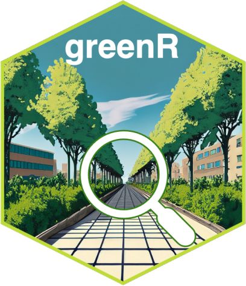
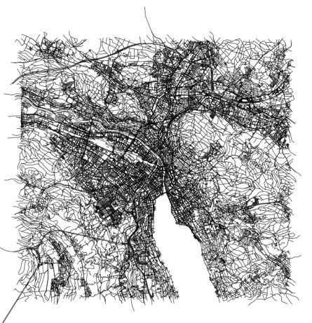
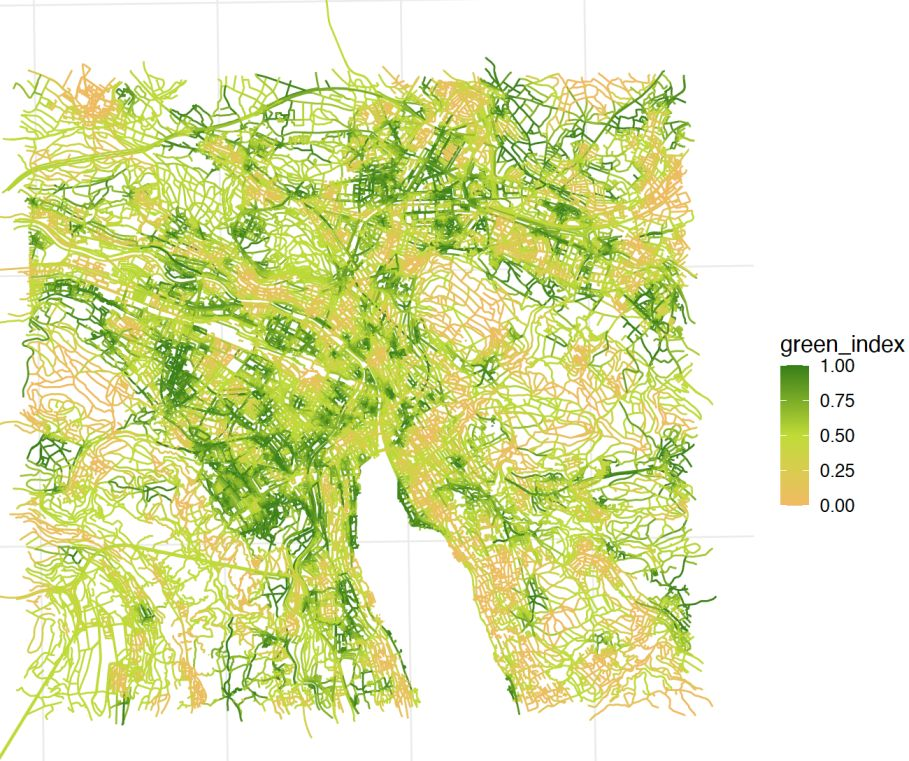
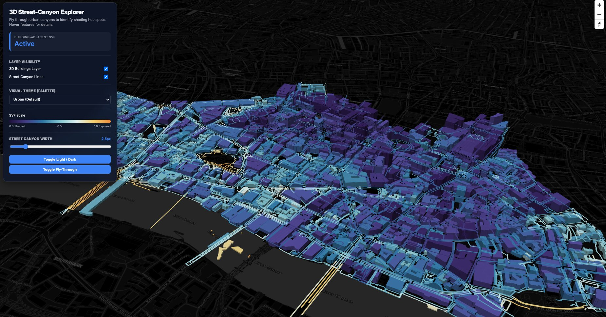
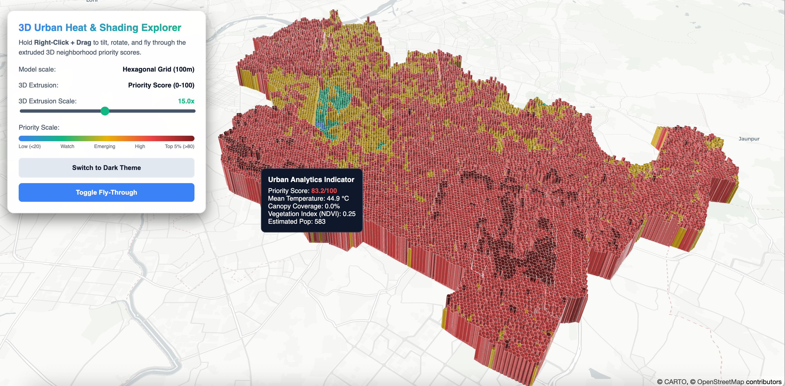
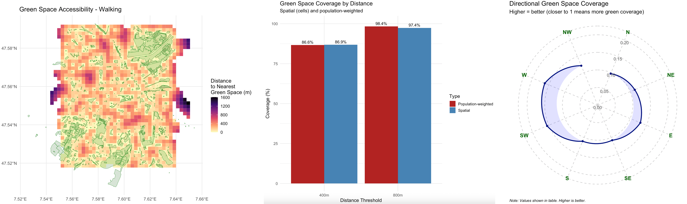
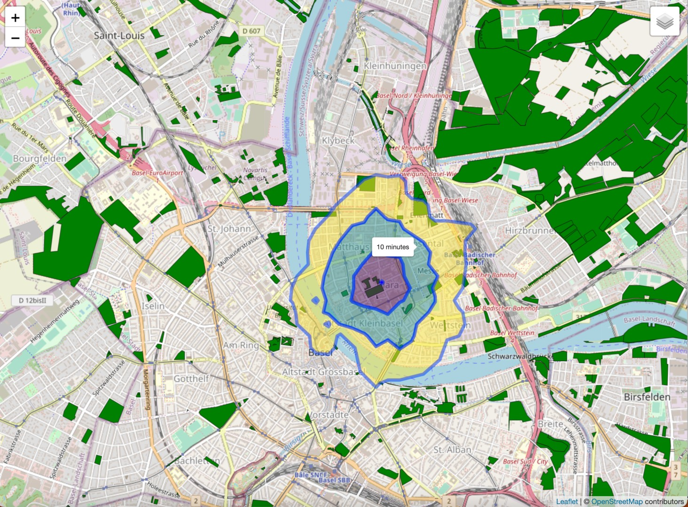

[](https://CRAN.R-project.org/package=greenR)


<p align="center">
  <a href="https://kartografie.ch/category/prixcarto/">
    
  </a>
</p>

<p align="center">
  
  
  
</p>

# greenR: Urban Environmental Analytics for R

**Quantify. Analyze. Visualize.**

greenR is an open-source R package for quantifying, analyzing, and visualizing urban greenness. It integrates OpenStreetMap, satellite imagery, population grids, and canopy height models into a unified analytical pipeline — from street-segment greenness scoring to city-scale climate-responsive planting prioritization.

> ✨ *Winner of the [Prix Carto 2025 – Edu category](https://kartografie.ch/category/prixcarto/) at the celebration of 100 years of the Institute of Cartography and Geoinformation at ETH Zurich.*

| Feature | Description |
|---------|-------------|
| 🌲 **Sky View Factor (SVF) 3D** | WebGL 3D structural canopy explorers and network-corridor SVF metrics |
| 🌡️ **Urban Heat Decision Suite** | Multi-criteria diamond bivariate planting prioritization with street canyon physics |
| 🌳 **Green Index** | Street-segment greenness scores with configurable distance decay |
| 🌴 **Canopy Height Modeling** | 1m resolution analysis using Meta/WRI ALS GEDI v6 global dataset |
| 🚶 **Accessibility Analysis** | Network-based isochrone mapping with walking/cycling routing |
| 📊 **Spatial Inequality** | H3 hexagonal binning, Gini indices, and Lorenz inequality curves |
| 🧭 **Directional Analysis** | Compass-oriented green space accessibility corridors |
| 📷 **Green View Index (GVI)** | Superpixel computer-vision vegetation quantification |
| ⚖️ **GSSI** | Cross-city green space similarity using spatial connectivity |
| 🗺️ **Interactive Visualizations** | Deck.gl WebGL 3D, multilayer Leaflets, ggplot2, and tmap outputs |
| 🖥️ **Shiny Application** | Zero-code web interface for all analytics |

📄 [Published in Ecological Indicators](https://www.sciencedirect.com/science/article/pii/S1470160X2400565X) · [CRAN Package Page](https://CRAN.R-project.org/package=greenR)

---

## Installation

```r
install.packages("greenR")                                            # CRAN
remotes::install_github("sachit27/greenR", dependencies = TRUE)       # GitHub dev
```

```r
library(greenR)
```

<details>
<summary>📋 <strong>Troubleshooting installation issues</strong></summary>

If you're updating from a previous version and encounter issues:
```r
remove.packages("greenR")
.rs.restartR()
devtools::install_github("sachit27/greenR", dependencies = TRUE, force = TRUE)
```

If the `osmdata` dependency fails from CRAN, install it directly:
```r
remotes::install_github("ropensci/osmdata")
```

</details>

---

# 🚀 Signature Suites

## 🌲 Sky View Factor (SVF) 3D Suite

*How much sky can a pedestrian actually see from the street — and where are the critical gaps in the urban canopy?*

<p align="center">
  
</p>

<p align="center">
  
</p>

<details>
<summary>🔬 <strong>Methodology, outputs & code examples</strong></summary>

### What it computes
```
Sky View Factor (SVF) = 1 − (Canopy Density + Built Obstruction Proxy)
```

SVF is modeled geometrically as the fraction of visible sky from a pedestrian perspective. A **low SVF** (near 0) indicates a highly closed canopy or deep street canyon, offering maximum shade. A **high SVF** (near 1) indicates full sky exposure, maximizing direct solar radiation.

### What it produces
- **3D Deck.gl WebGL dashboards** — Fly through neighborhoods, inspect vertical canopy structures, toggle tree layers
- **2D street corridor SVF maps** — Network-scale microclimate maps on CartoDB basemaps
- **SVF distribution analytics** — Statistical distributions, histograms, and summary tables
- **Interactive Leaflet maps** — Multi-layer toggleable web maps

### Example: London SVF Analysis
```R
library(greenR)

svf_results <- uh_svf(
  city_name       = "City of London, UK",
  hex_size_m      = 100,
  use_cache       = TRUE,
  include_leaflet = TRUE,
  include_3d      = TRUE,
  output_dir      = "./london_svf_outputs",
  output_prefix   = "london_full"
)

# Open interactive 3D explorer
browseURL("./london_svf_outputs/london_full_3d_explorer.html")
```

</details>

---

## 🌡️ Urban Heat Decision Suite & Canyon Physics

*We have limited budget — where do high thermal exposure and planting opportunities actually intersect?*

<p align="center">
  
</p>

<p align="center">
  
</p>

<p align="center">
  
</p>

<details>
<summary>🔬 <strong>Methodology, outputs & code examples</strong></summary>

### Bivariate Diamond Prioritization
The engine maps spatial "Need" (heat exposure × population) and "Opportunity" (lack of canopy and vegetation) into a **45-degree rotated 3×3 diamond bivariate matrix**:

```
Heat Exposure       = 0.5 × rank(LST) + 0.5 × rank(log1p(population))
Cooling Deficit     = 0.5 × (1 − rank(NDVI)) + 0.5 × (1 − rank(Canopy Height))
Tree Need Score     = 100 × √(Heat Exposure × Cooling Deficit)
Planting Opportunity = 100 × (1 − rank(Canopy Height))
Master Priority     = 100 × √(Tree Need × Planting Opportunity)
```

The geometric mean guarantees that **both** structural vulnerability and physical planting capacity must be high for a location to rank as top priority.

### Latitude-Aware Street Canyon Physics
The framework implements physical, pedestrian-scale street canyon priority indexing:

- **Canyon Buffering:** Roads → 2D canyon polygons (15m motorway, 10m secondary, 6m residential)
- **Compass Bearing:** Vectorized start-to-end azimuth calculation (0–180°)
- **Solar Exposure Model:**
  $$\text{Solar Exposure} = \sin(|\text{lat}|) \times |\sin(\text{bearing})| + (1 - \sin(|\text{lat}|)) \times 1$$
  E–W canyons are prioritized at mid-latitudes (high noon beam radiation), while the directional bias correctly disappears for equatorial cities.

### What it produces
- **Diamond bivariate maps** — Rotated 3×3 legend with four interpretive quadrants (Top Priority, Cooler, Constrained, Sufficient)
- **Street canyon priority corridors** — Continuous priority coloring along every road buffer
- **Morphological block superblocks** — Voronoi/OSM-based neighborhood subdivision
- **Action class maps** — Top 5% intervention tiers at both block and hexagon scales
- **3D Deck.gl dashboards** — Extruded neighborhood columns and hexagonal columns
- **Interactive multilayer Leaflet** — Toggleable overlays of all analysis layers

### Example 1: Full City (Online Mode)
```R
library(greenR)

results <- uh_decision(
  city_name    = "Basel, Switzerland",
  hex_size_m   = 100,
  output_dir   = "./basel_outputs",
  output_prefix = "basel"
)
```

### Example 2: Bounding Box with Local Population Data
```R
library(greenR)
library(sf)

zurich_bbox <- sf::st_as_sfc(
  sf::st_bbox(c(xmin = 8.523, ymin = 47.365, xmax = 8.555, ymax = 47.393), crs = 4326)
) |> sf::st_sf()

results <- uh_decision(
  city_name       = "Zurich Center, Switzerland",
  hex_size_m      = 80,
  local_boundary  = zurich_bbox,
  use_cache       = TRUE,
  include_leaflet = TRUE,
  include_3d      = TRUE,
  output_dir      = "./zurich_outputs",
  output_prefix   = "zurich_quick"
)
```

### Example 3: Local GHSL Population Raster
```R
results <- uh_decision(
  city_name        = "New Delhi, India",
  hex_size_m       = 100,
  local_population = "GHS_POP_E2030_GLOBE_R2023A_54009_100_V1_0_R6_C26.tif",
  use_cache        = TRUE,
  include_leaflet  = TRUE,
  include_3d       = TRUE,
  output_dir       = "./newdelhi_outputs"
)
```

</details>

---

# 🌍 Data Workflows: Online, Local & Hybrid Modes

`greenR` is designed to be highly flexible, supporting different data workflows depending on data sensitivity, local resolution requirements, and internet connectivity.

<details>
<summary>🌐 <strong>Mode 1: Online Mode (Hands-Free API Retrieval)</strong></summary>

Best for **rapid scoping, exploratory analysis, and multi-city comparisons**. `greenR` automatically queries online REST APIs and spatial servers to gather all required street, canopy, population, and satellite data on-the-fly.

### Automated Sources
*   **OpenStreetMap (OSM)**: Street networks, buildings, parks, and tree counts are fetched using a high-performance Overpass API retrieval pipeline.
*   **Satellite Imagery (NDVI & Land Surface Temp)**: Automatically queried and composited from Landsat 8/9 and Sentinel-2 STAC endpoints.
*   **Canopy Height Model (CHM)**: Fetched at 1-meter resolution using the Meta/WRI global LiDAR ALS GEDI v6 dataset.
*   **Population**: Aggregated dynamically from the Joint Research Centre’s Global Human Settlement Layer (GHSL) raster database.

### Code Example
```R
library(greenR)

# Fetch, analyze, and build interactive 3D dashboards with zero local files!
results <- uh_decision(
  city_name  = "Geneva, Switzerland",
  hex_size_m = 100,
  output_dir = "./geneva_outputs"
)
```

</details>

<details>
<summary>📂 <strong>Mode 2: Local Mode (Completely Offline / Secure Projects)</strong></summary>

Best for **municipalities, private planning consulting, or offline computational servers**. You can bypass all online API calls by feeding in pre-existing local shapefiles, GeoJSONs, and custom high-resolution LiDAR or satellite rasters.

### Code Example
```R
library(greenR)
library(sf)
library(terra)

# 1. Load local spatial vector layers (GeoJSON / Shapefiles / GPKG)
my_boundary  <- sf::st_read("data/municipal_boundary.geojson")
my_trees     <- sf::st_read("data/tree_inventory_points.shp")
my_buildings <- sf::st_read("data/building_footprints.gpkg")

# 2. Load local satellite & raster datasets (GeoTIFF)
my_lst  <- terra::rast("data/local_thermal_lst.tif")
my_chm  <- terra::rast("data/high_res_airborne_lidar_chm.tif")
my_pop  <- terra::rast("data/exact_census_block_population.tif")
my_ndvi <- terra::rast("data/sentinel_ndvi_spring.tif")

# 3. Package street & green layers into a local OSM list to bypass Overpass completely
my_osm_list <- list(
  highways    = list(osm_lines    = sf::st_read("data/street_network.geojson")),
  green_areas = list(osm_polygons = sf::st_read("data/parks_and_nature_reserves.geojson")),
  trees       = list(osm_points   = my_trees),
  buildings   = list(osm_polygons = my_buildings)
)

# 4. Execute fully offline with local files
results <- uh_decision(
  city_name            = "Municipal Offline Analysis",
  hex_size_m           = 50,
  local_boundary       = my_boundary,
  local_osm_layers     = my_osm_list,
  local_ndvi           = my_ndvi,
  local_lst            = my_lst,
  local_chm            = my_chm,
  local_population     = my_pop,
  local_buildings      = my_buildings,
  include_leaflet      = TRUE,
  include_3d           = TRUE,
  output_dir           = "./local_offline_outputs"
)
```

</details>

<details>
<summary>⚡ <strong>Mode 3: Hybrid Mode (Online Streets + Local Proprietary Overrides)</strong></summary>

Best for **maximizing accuracy while saving setup time**. You let `greenR` download baseline street networks and satellite composites online, but seamlessly override specific layers with your high-resolution local datasets (e.g., proprietary municipal LiDAR rasters or internal census grids).

### Code Example
```R
library(greenR)
library(terra)

# Load a high-resolution local population grid and a local LiDAR canopy model,
# but let greenR handle the street network, green areas, and LST online!
local_pop_grid  <- terra::rast("data/high_res_census_pop.tif")
local_lidar_chm <- terra::rast("data/municipal_lidar_chm.tif")

results <- uh_decision(
  city_name        = "Zurich, Switzerland",
  hex_size_m       = 80,
  local_population = local_pop_grid,   # overrides online GHSL pop
  local_chm        = local_lidar_chm,  # overrides online 1m Meta CHM
  output_dir       = "./zurich_hybrid_outputs"
)
```

</details>

---

# 📊 Classical Urban Analytics


## 🌳 Green Index Quantification

*What is the relative greenness of every street segment in a city?*


<details>
<summary>🔬 <strong>Details & code</strong></summary>

### Data Acquisition
```R
data <- get_osm_data("City of London, United Kingdom")
# Or with a bounding box:
data <- get_osm_data(c(-0.1, 51.5, 0.1, 51.7))
```
### Handling Overpass API Timeouts
OpenStreetMap data is retrieved via the Overpass API. Occasionally, you may encounter an error such as: HTTP 504 Gateway Timeout
This typically occurs when the default Overpass server is temporarily overloaded.

If this happens, you can switch to an alternative Overpass mirror before running get_osm_data():

```R
library(osmdata)

# Set an alternative Overpass server
set_overpass_url("https://lambert.openstreetmap.de/api/interpreter")

# Then retry
data <- get_osm_data("Basel, Switzerland")
```

### Calculate Green Index
The green index (0–1) quantifies the relative greenness of each street segment using distance-decay functions weighted by proximity to green spaces and tree density. The parameter `D` controls the decay distance in meters.

```R
green_index <- calculate_green_index(data, 4326, 100)
```

### Visualize
```R
# Static plot
map <- plot_green_index(green_index)

# Interactive Leaflet with dark basemap
map <- plot_green_index(green_index, interactive = TRUE, base_map = "CartoDB.DarkMatter")

# 3D Linestring map (Mapbox)
mapbox_token <- "your_mapbox_access_token_here"
create_linestring_3D(green_index, "green_index", mapbox_token)

# 3D Hex map (Mapbox)
create_hexmap_3D(
  data = green_index,
  value_col = "green_index",
  mapbox_token = mapbox_token,
  output_file = "map.html",
  color_palette = "interpolateViridis"
)
```

### Calculate Edge Percentage Tiers
```R
percentage <- calculate_percentage(green_index) # Low (<0.4), Medium (0.4-0.7), High (>0.7)
```

### Export Data
```R
save_json(green_index, "/path/to/map.geojson")
save_as_leaflet(green_index, "/path/to/map.html")
```


</details>

---

## 🗺️ Green Spaces, Clustering & Density

*How are green spaces and trees distributed across the city — and how equitable is that distribution?*


<details>
<summary>🔬 <strong>Details & code</strong></summary>

### Visualize & Cluster Green Spaces
```R
green_areas_data <- data$green_areas
visualize_green_spaces(green_areas_data)
green_space_clustering(green_areas_data, num_clusters = 3)
```

### H3 Hexagonal Density & Inequality Analysis
Quantifies spatial distribution using H3 hexagonal bins, computing Gini coefficients, Lorenz curves, skewness, kurtosis, and classification thresholds:

```R
osm_data <- get_osm_data("Zurich, Switzerland")
result <- analyze_green_and_tree_count_density(
  osm_data = osm_data,
  mode = "tree_density",     # or "green_area"
  h3_res = 8,
  save_lorenz = TRUE
)
result$map        # Interactive Leaflet map
result$analytics  # Summary statistics and Gini index
result$lorenz_plot # Lorenz curve
```

</details>

---

## 🚶 Accessibility Analysis

*How far does every resident have to walk to reach the nearest green space — and does it vary by direction?*

<p align="center">
  
  
</p>

<details>
<summary>🔬 <strong>Details & code</strong></summary>

### Mapbox Dynamic Isochrones
```R
mapbox_token <- "your_mapbox_access_token_here"
accessibility_mapbox(green_areas_data, mapbox_token)
```


### Leaflet Multi-Tier Isochrones
```R
result <- accessibility_greenspace(
  green_areas_data, 
  47.564275, 7.595820,
  output_file = "green_space_accessibility.gpkg"
)
```

### Directional Access & Population Coverage
Quantifies how green space access varies by compass direction (N, NE, E, SE, S, SW, W, NW) from each grid cell, and evaluates population-weighted accessibility thresholds:

```R
data <- get_osm_data("Basel, Switzerland")
pop_raster_raw <- terra::rast("GHS_POP_E2025_GLOBE_R2023A_54009_100_V1_0_R4_C19.tif")
network <- data$highways$osm_lines
green   <- data$green_areas$osm_polygons

result <- analyze_green_accessibility(
  network_data      = network,
  green_areas       = green,
  mode              = "walking",
  grid_size         = 300,
  population_raster = pop_raster_raw
)
viz <- create_accessibility_visualizations(
  accessibility_analysis = result,
  green_areas = green,
  mode = "walking"
)
print(viz$distance_map)
print(viz$coverage_plot)
print(viz$directional_plot)
viz$leaflet_map
```

> **Note on edge effects:** Grid cells near the study area boundary may show inflated distances because green spaces just outside the boundary are excluded. Consider expanding the boundary or interpreting edge cells with caution.

</details>

---

## 🌡️ Classical Urban Heat Island (UHI) Analysis

*Where are the thermal hotspots — and how do they correlate with green coverage and built density?*


<details>
<summary>🔬 <strong>Details & code</strong></summary>

Detects and analyzes urban heat islands by integrating **Landsat 8/9** thermal imagery with OSM environmental layers and optional GHSL Built-up Surface rasters:

- **H3 hexagonal aggregation** for consistent spatial analysis
- **Getis-Ord Gi* hotspot analysis** with statistical significance testing
- **Moran's I** spatial autocorrelation
- **Correlation and regression** between LST, green coverage, and built-up intensity

```r
result <- analyze_and_visualize_uhi(
  location = "Zurich, Switzerland",
  date_range = c("2023-06-01", "2023-08-31"),
  hex_resolution = 9,
  ghsl_path = "path/to/ghsl_built.tif",
  thermal_source = "auto",
  composite_scenes = TRUE,
  max_scenes = 5,
  lst_percentile_filter = c(0.01, 0.99),
  correlation_method = "spearman",
  use_exactextract = TRUE
)
result$maps$interactive
result$maps$scatter
result$export_results("zurich_uhi", formats = c("geojson", "csv", "gpkg", "shp"))
```

</details>

---

## 🌴 Canopy Height Model (CHM) Analysis

*What is the vertical structure of the urban tree canopy at 1-meter resolution?*


<details>
<summary>🔬 <strong>Details & code</strong></summary>

Downloads, mosaics, and analyzes high-resolution canopy height tiles from **Meta & WRI's global 1m ALS GEDI v6 dataset** (2024). Computes statistics, generates publication-quality maps, and quantifies tree cover above user-defined height thresholds.

```R
result <- chm_analysis(
  bbox = c(7.55, 47.54, 7.62, 47.59),     # Basel, Switzerland
  output_dir = "chm_output",
  max_tiles = 5,
  height_threshold = 2,
  create_plots = TRUE
)
print(result$stats)
result$static_map
browseURL(result$mapview_file)
```

The implementation is inspired by the excellent [chmloader](https://github.com/) R package, adapted for integration with the greenR urban analytics workflow.

</details>

---

## 📷 Green View Index (GVI)

*What proportion of the visible streetscape is vegetation?*


<details>
<summary>🔬 <strong>Details & code</strong></summary>

Quantifies urban greenness through image analysis using [SuperpixelImageSegmentation](https://cran.r-project.org/web/packages/SuperpixelImageSegmentation/SuperpixelImageSegmentation.pdf). The GVI is calculated as:

$$GVI = \frac{\text{Number of Green Pixels}}{\text{Total Number of Pixels}}$$

```R
result <- calculate_and_visualize_GVI("/path/to/your/image.png")
OpenImageR::imageShow(result$segmented_image)

green_pixels_raster <- as.raster(result$green_pixels_image)
plot(green_pixels_raster)

# Save outputs
OpenImageR::writeImage(result$segmented_image, "/path/to/save/segmented_image.png")
OpenImageR::writeImage(result$green_pixels_image, "/path/to/save/green_pixels_image.png")
```

</details>

---

## ⚖️ Green Space Similarity Index (GSSI)

*How do green space networks compare across different cities in size and connectivity?*

<details>
<summary>🔬 <strong>Details & code</strong></summary>

The GSSI is a composite metric combining the coefficient of variation in green space sizes with the Average Nearest Neighbor Distance (ANND). Scores are normalized against the highest-scoring city for relative comparisons.

```r
d1 <- get_osm_data("New Delhi, India")
dsf <- d1$green_areas$osm_polygons
d2 <- get_osm_data("Basel, Switzerland")
bsf <- d2$green_areas$osm_polygons
d3 <- get_osm_data("Medellin, Colombia")
msf <- d3$green_areas$osm_polygons

cities_data <- list(dsf, bsf, msf)
gssi_values <- gssi(cities_data, "ESRI:54009")
```

</details>

---

## 🖥️ Shiny Application

*Analyze urban greenness without writing a single line of code.*


```R
run_app()
```

---

# 🛠️ Reference

## Citation

**APA**: Mahajan, S., 2024. greenR: An open-source framework for quantifying urban greenness. *Ecological Indicators* 163, 112108. [doi:10.1016/j.ecolind.2024.112108](https://doi.org/10.1016/j.ecolind.2024.112108)

<details>
<summary>📋 <strong>BibTeX</strong></summary>

```bibtex
@article{MAHAJAN2024112108,
  title   = {greenR: An open-source framework for quantifying urban greenness},
  journal = {Ecological Indicators},
  volume  = {163},
  pages   = {112108},
  year    = {2024},
  issn    = {1470-160X},
  doi     = {https://doi.org/10.1016/j.ecolind.2024.112108},
  url     = {https://www.sciencedirect.com/science/article/pii/S1470160X2400565X},
  author  = {Sachit Mahajan},
  keywords = {Urban greenness, Open source, Urban analytics, Cities, Street network}
}
```

</details>

<details>
<summary>🔧 <strong>Handling SSL certificate errors</strong></summary>

If you encounter:
```R
Error in curl::curl_fetch_memory(url, handle = handle) :
Peer certificate cannot be authenticated with given CA certificates
```
Update the CA certificates on your system or configure R's SSL settings.

</details>

<details>
<summary>⚡ <strong>Performance notice</strong></summary>

1. **Processing time:** Large metropolitan areas take significantly longer than neighborhoods. Start small.
2. **Resources:** Intensive spatial algorithms require ample RAM and CPU. Ensure your machine meets requirements.
3. **Testing:** Begin with a small bounding box or neighborhood to estimate timings on your hardware.

</details>

## Acknowledgments
OpenStreetMap data is available under the [Open Database License (ODbL)](https://opendatacommons.org/licenses/odbl/).
