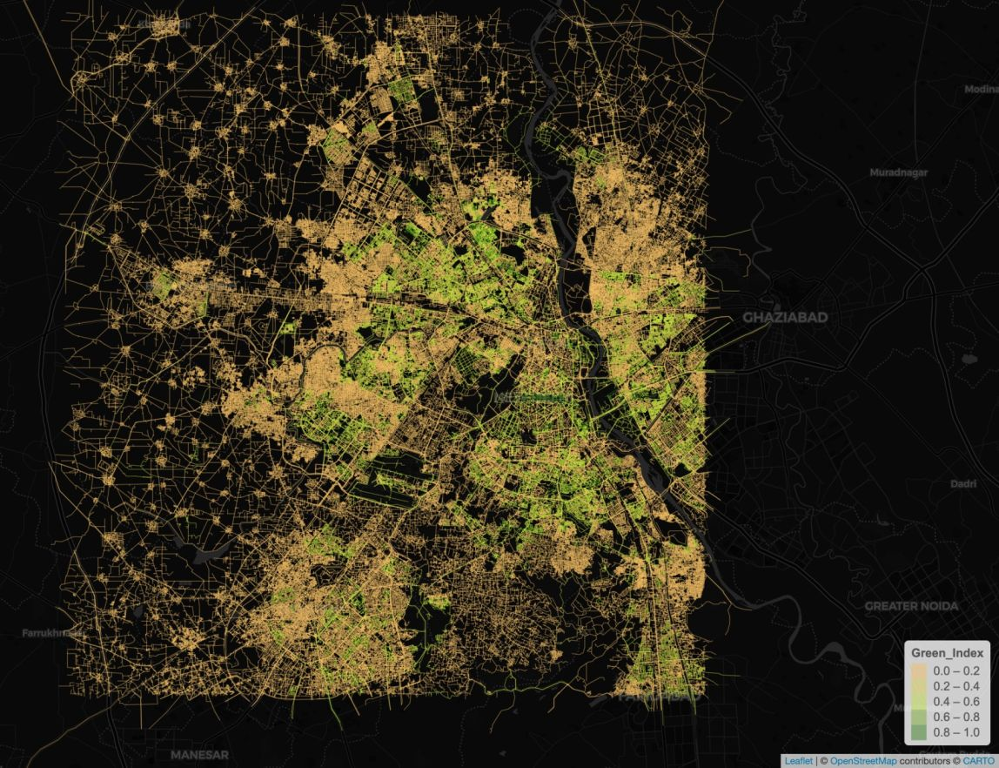
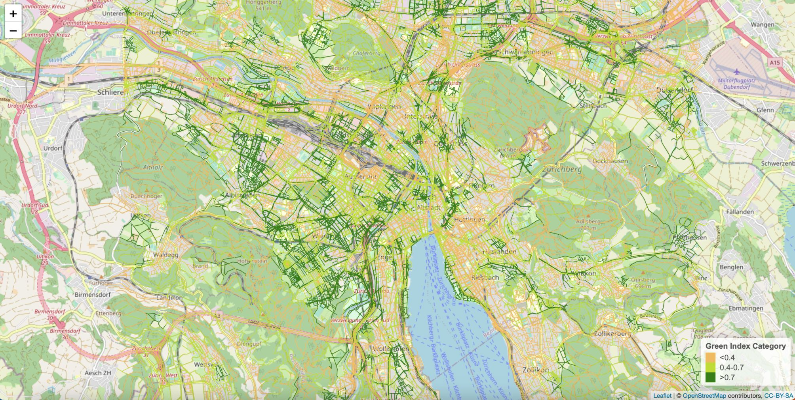
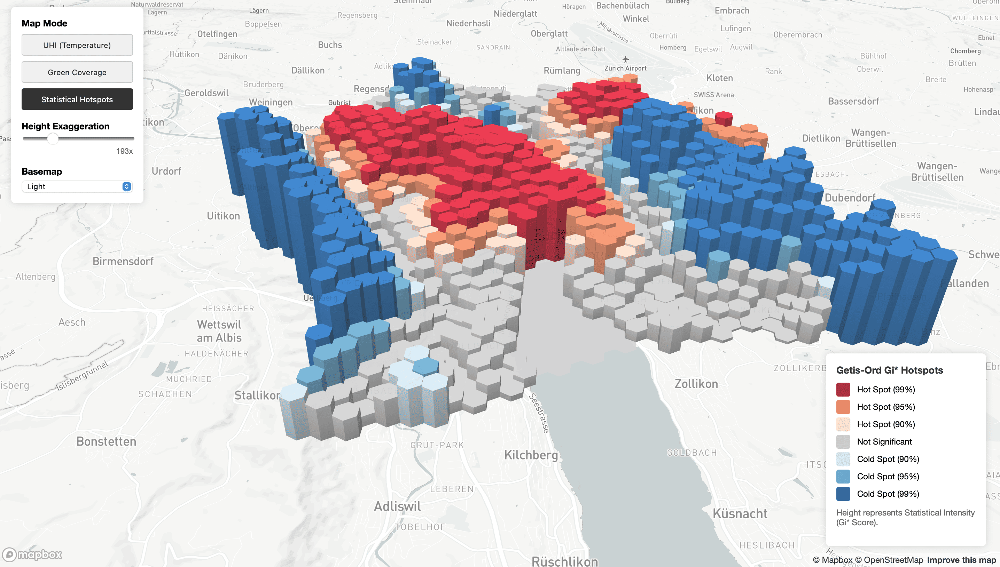
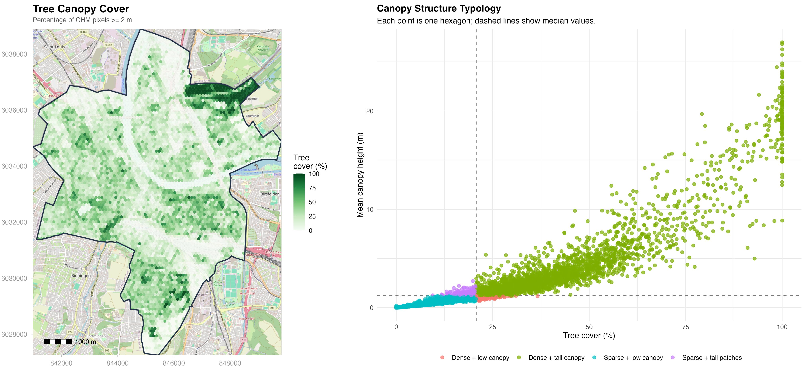
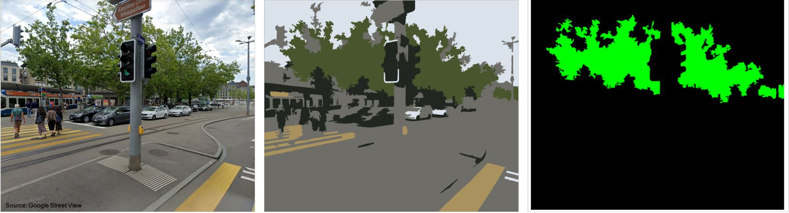
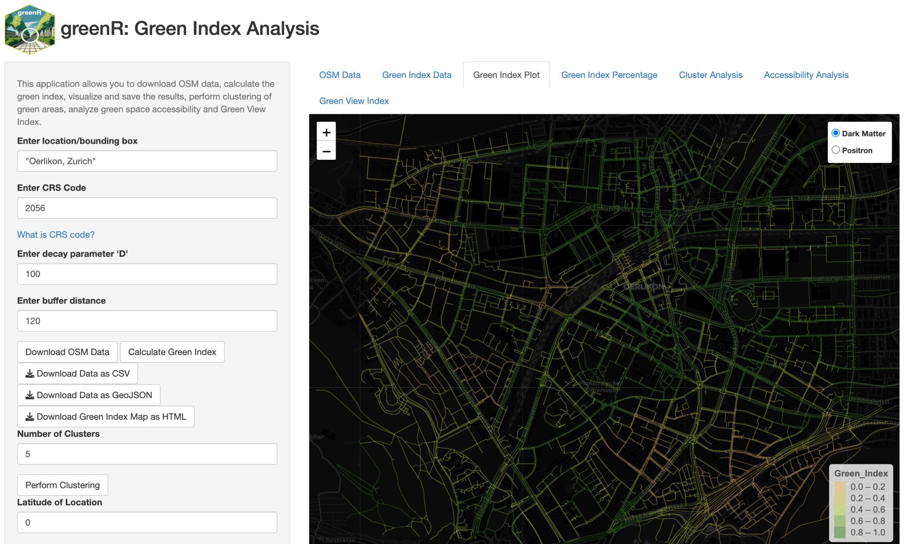

[](https://CRAN.R-project.org/package=greenR)
[](https://cran.r-project.org/package=greenR)
[](https://www.gnu.org/licenses/gpl-3.0)
[](https://www.sciencedirect.com/science/article/pii/S1470160X2400565X)
[](https://www.sciencedirect.com/science/article/pii/S1470160X2400565X)


<p align="center">
  <a href="https://kartografie.ch/category/prixcarto/">
    
  </a>
</p>

<p align="center">
  
  
  
</p>

# greenR: Urban Environmental Analytics for R

**Quantify. Analyze. Visualize.**

`greenR` is an award-winning open-source R package for quantifying, analyzing, and visualizing urban greenness and microclimate priorities. It integrates OpenStreetMap, satellite imagery, population grids, and canopy height models into a unified analytical pipeline — from street-segment greenness scoring to city-scale climate-responsive planting prioritization.

> ✨ *Winner of the **[Prix Carto 2025 – Edu category](https://kartografie.ch/category/prixcarto/)** at the celebration of 100 years of the Institute of Cartography and Geoinformation at ETH Zurich.*

| Feature | Description |
|---------|-------------|
| 🌲 **Sky View Factor (SVF) 3D** | WebGL 3D structural canopy explorers and network-corridor SVF metrics |
| 🌡️ **Urban Heat Decision Suite** | Multi-criteria diamond bivariate planting prioritization with street canyon physics |
| 🌳 **Green Index** | Street-segment greenness scores with configurable distance decay |
| 🌴 **Canopy Height Modeling** | 1m resolution analysis using Meta/WRI ALS GEDI v6 global dataset |
| 🚶 **Accessibility Analysis** | Network-based isochrone mapping with walking/cycling routing |
| 📊 **Spatial Inequality** | H3 hexagonal binning, Gini indices, and Lorenz inequality curves |
| 🧭 **Directional Analysis** | Compass-oriented green space accessibility corridors |
| 📷 **Green View Index (GVI)** | Superpixel computer-vision vegetation quantification |
| ⚖️ **GSSI** | Cross-city green space similarity using spatial connectivity |
| 🗺️ **Interactive Visualizations** | Deck.gl WebGL 3D, multilayer Leaflets, ggplot2, and tmap outputs |
| 🖥️ **Shiny Application** | Zero-code web interface for all analytics |

📄 [Published in Ecological Indicators](https://www.sciencedirect.com/science/article/pii/S1470160X2400565X) · [CRAN Package Page](https://CRAN.R-project.org/package=greenR)

---

## ⚙️ System Dependencies

Because `greenR` leverages high-performance C++ geocomputational engines via `sf` and `terra`, it requires key spatial system libraries (`GDAL`, `GEOS`, `PROJ`) to be installed on your operating system prior to package installation.

> [!IMPORTANT]
> **Ensure system libraries are installed first:** If these libraries are missing from your PATH, R will fail to compile `sf` and `terra` from source.

### 🍎 macOS (via Homebrew)
Open your Terminal and run:
```bash
brew install gdal geos proj
```

### 🐧 Ubuntu / Debian
Install development libraries using `apt-get`:
```bash
sudo apt-get update
sudo apt-get install -y libgdal-dev libgeos-dev libproj-dev libudunits2-dev
```

### 🪟 Windows
1. Download and install **[Rtools](https://cran.r-project.org/bin/windows/Rtools/)** matching your R version.
2. Binary builds for `sf` and `terra` on CRAN include pre-compiled system libraries automatically.

---

## ⚡ Quick Start: Fine-Grained Street Greenness Analysis

You don't need local spatial files to start. Run the following code in R to automatically download street networks, compute street-segment greenness with distance decay, and render an interactive dark-themed map:

```R
library(greenR)
library(sf)

# 1. Fetch street network and green spaces dynamically from OpenStreetMap
city_data <- get_osm_data("City of London, UK")

# 2. Compute street-segment Green Index with a 100m distance-decay parameter
green_network <- calculate_green_index(city_data, crs_code = 4326, D = 100)

# 3. Visualize the greenness of the street network interactively
interactive_map <- plot_green_index(
  green_network, 
  interactive = TRUE, 
  base_map = "CartoDB.DarkMatter"
)

# 4. Render the dynamic spatial web map
print(interactive_map)
```

<p align="center">
  
</p>

---

# 🚀 Signature Suites

## 🌲 Sky View Factor (SVF) 3D Suite

*How much sky can a pedestrian actually see from the street — and where are the critical gaps in the urban canopy?*

<p align="center">
  
  <br/>
  
</p>

### 🔬 Methodology, outputs & multi-mode code examples

### What it computes
```
Sky View Factor (SVF) = 1 − (Canopy Density + Built Obstruction Proxy)
```

SVF is modeled geometrically as the fraction of visible sky from a pedestrian perspective. A **low SVF** (near 0) indicates a highly closed canopy or deep street canyon, offering maximum shade. A **high SVF** (near 1) indicates full sky exposure, maximizing direct solar radiation.

### What it produces
- **3D Deck.gl WebGL dashboards** — Fly through neighborhoods, inspect vertical canopy structures, toggle tree layers
- **2D street corridor SVF maps** — Network-scale microclimate maps on CartoDB basemaps
- **SVF distribution analytics** — Statistical distributions, histograms, and summary tables
- **Interactive Leaflet maps** — Multi-layer toggleable web maps

---

### 🌐 Example 1: Purely Online Mode (Zero local data setup)
Automatically downloads London street networks, terrain elevations, building vectors, and Meta/WRI 1m GEDI canopy height data on-the-fly!
```R
library(greenR)

svf_results <- uh_svf(
  city_name        = "City of London, UK",
  analysis_scale   = "city_screening",
  terrain_source   = "elevatr",
  elevatr_z        = 13,
  buildings_source = "gba",
  sample_mode      = "both",                 # MUST be "both" or "grid" to compute buildings and enable 3D!
  spacing_street_m = 30,                     # Spacing along street network (meters)
  spacing_grid_m   = 50,                     # Grid sampling interval (meters)
  n_directions     = 36,                     # Number of ray-cast directions
  include_leaflet  = TRUE,                    # Build interactive Leaflet map
  include_3d       = TRUE,                    # Build fully interactive 3D WebGL explorer
  output_dir       = "./london_svf_outputs",  # Save files in this directory
  output_prefix    = "london_full"            # Prefix for all generated maps & assets
)

# Open interactive 3D explorer
browseURL("./london_svf_outputs/london_full_svf_3d_explorer.html")
```

### 📂 Example 2: Completely Local / Offline Mode (For secure or custom datasets)
Perfect for using proprietary municipal shapefiles, building footprints, and custom airborne LiDAR rasters without any internet requests.
```R
library(greenR)
library(sf)
library(terra)

# 1. Load local spatial layers and canopy rasters
local_boundary <- sf::st_read("data/london_district_boundary.geojson")
local_streets  <- sf::st_read("data/london_highway_lines.geojson")
local_buildings <- sf::st_read("data/london_buildings.geojson")
local_canopy   <- terra::rast("data/airborne_lidar_chm_1m.tif")

# 2. Package street and environmental layers into local OSM list format
local_osm <- list(
  highways    = list(osm_lines    = local_streets),
  green_areas = list(osm_polygons = sf::st_read("data/parks.geojson")),
  trees       = list(osm_points   = sf::st_read("data/trees.geojson"))
)

# 3. Run fully offline using local overrides
svf_results <- uh_svf(
  city_name        = "Local SVF Analysis",
  boundary         = local_boundary,
  terrain_source   = "local",
  terrain_path     = "data/local_dem_10m.tif",
  buildings_source = "local",
  buildings_object = local_buildings,
  canopy_object    = local_canopy,
  local_osm_layers = local_osm,
  include_leaflet  = TRUE,
  include_3d       = TRUE,
  output_dir       = "./london_svf_offline",
  output_prefix    = "london_offline"
)
```

### ⚡ Example 3: Hybrid Mode (Online streets + local LiDAR DSM)
Let greenR fetch the street network dynamically from OpenStreetMap, but override the tree canopy dataset with your own ultra-high-resolution municipal LiDAR raster.
```R
library(greenR)
library(terra)

# Load local DSM raster
my_lidar_chm <- terra::rast("data/municipal_lidar_dsm.tif")

svf_results <- uh_svf(
  city_name        = "Zurich, Switzerland",
  terrain_source   = "elevatr",
  buildings_source = "gba",
  sample_mode      = "both",                  # Computes both street and building SVF for 3D mapping
  canopy_object    = my_lidar_chm,            # Overrides global GEDI CHM with local raster
  include_leaflet  = TRUE,
  include_3d       = TRUE,
  output_dir       = "./zurich_svf_hybrid",
  output_prefix    = "zurich_hybrid"
)
```


---

## 🌡️ Urban Heat Decision Suite & Canyon Physics

*We have limited budget — where do high thermal exposure and planting opportunities actually intersect?*

<p align="center">
  
  <br/>
  
  <br/>
  
</p>

### 🔬 Methodology, outputs & code examples

### Bivariate Diamond Prioritization
The engine maps spatial "Need" (heat exposure × population) and "Opportunity" (lack of canopy and vegetation) into a **45-degree rotated 3×3 diamond bivariate matrix**:

```
Heat Exposure       = 0.5 × rank(LST) + 0.5 × rank(log1p(population))
Cooling Deficit     = 0.5 × (1 − rank(NDVI)) + 0.5 × (1 − rank(Canopy Height))
Tree Need Score     = 100 × √(Heat Exposure × Cooling Deficit)
Planting Opportunity = 100 × (1 − rank(Canopy Height))
Master Priority     = 100 × √(Tree Need × Planting Opportunity)
```

The geometric mean guarantees that **both** structural vulnerability and physical planting capacity must be high for a location to rank as top priority.

### Latitude-Aware Street Canyon Physics
The framework implements physical, pedestrian-scale street canyon priority indexing:

- **Canyon Buffering:** Roads → 2D canyon polygons (15m motorway, 10m secondary, 6m residential)
- **Compass Bearing:** Vectorized start-to-end azimuth calculation (0–180°)
- **Solar Exposure Model:**
  $$\text{Solar Exposure} = \sin(|\text{lat}|) \times |\sin(\text{bearing})| + (1 - \sin(|\text{lat}|)) \times 1$$
  E–W canyons are prioritized at mid-latitudes (high noon beam radiation), while the directional bias correctly disappears for equatorial cities.

### What it produces
- **Diamond bivariate maps** — Rotated 3×3 legend with four interpretive quadrants (Top Priority, Cooler, Constrained, Sufficient)
- **Street canyon priority corridors** — Continuous priority coloring along every road buffer
- **Morphological block superblocks** — Voronoi/OSM-based neighborhood subdivision
- **Action class maps** — Top 5% intervention tiers at both block and hexagon scales
- **3D Deck.gl dashboards** — Extruded neighborhood columns and hexagonal columns
- **Interactive multilayer Leaflet** — Toggleable overlays of all analysis layers

### Example 1: Full City (Online Mode)
Run the complete UHI planting prioritization suite dynamically using purely online spatial data:
```R
library(greenR)

results <- uh_decision(
  city_name       = "Zurich, Switzerland",   # Fetches boundary automatically from OSM
  hex_size_m      = 100,                     # 100m hexagon spatial resolution
  use_cache       = TRUE,                    # Caches on-the-fly downloads to avoid re-fetching
  include_leaflet = TRUE,                    # Builds interactive multilayer Leaflet map
  include_3d      = TRUE,                    # Builds 3D WebGL explorers (neighborhood & hex grid columns)
  include_gis     = TRUE,                    # Exports raw spatial data (GeoPackage, GeoJSON)
  output_dir      = "./zurich_outputs",      # Save all files in this directory
  output_prefix   = "zurich_full"            # Prefix for generated files
)

# Open interactive explorers in your browser:
utils::browseURL("./zurich_outputs/zurich_full_multilayer_leaflet.html")
utils::browseURL("./zurich_outputs/zurich_full_3d_explorer.html")
utils::browseURL("./zurich_outputs/zurich_full_3d_hex_explorer.html")
```

### Example 2: Bounding Box with Local Population Data
```R
library(greenR)
library(sf)

zurich_bbox <- sf::st_as_sfc(
  sf::st_bbox(c(xmin = 8.523, ymin = 47.365, xmax = 8.555, ymax = 47.393), crs = 4326)
) |> sf::st_sf()

results <- uh_decision(
  city_name       = "Zurich Center, Switzerland",
  hex_size_m      = 80,
  local_boundary  = zurich_bbox,
  use_cache       = TRUE,
  include_leaflet = TRUE,
  include_3d      = TRUE,
  output_dir      = "./zurich_outputs",
  output_prefix   = "zurich_quick"
)
```

### Example 3: Local GHSL Population Raster
```R
results <- uh_decision(
  city_name        = "New Delhi, India",
  hex_size_m       = 100,
  local_population = "GHS_POP_E2030_GLOBE_R2023A_54009_100_V1_0_R6_C26.tif",
  use_cache        = TRUE,
  include_leaflet  = TRUE,
  include_3d       = TRUE,
  output_dir       = "./newdelhi_outputs"
)
```


---

# 🌍 Data Workflows: Online, Local & Hybrid Modes

`greenR` is designed to be highly flexible, supporting different data workflows depending on data sensitivity, local resolution requirements, and internet connectivity.

<details>
<summary>🌐 <strong>Mode 1: Online Mode (Hands-Free API Retrieval)</strong></summary>

Best for **rapid scoping, exploratory analysis, and multi-city comparisons**. `greenR` automatically queries online REST APIs and spatial servers to gather all required street, canopy, population, and satellite data on-the-fly.

### Automated Sources
*   **OpenStreetMap (OSM)**: Street networks, buildings, parks, and tree counts are fetched using a high-performance Overpass API retrieval pipeline.
*   **Satellite Imagery (NDVI & Land Surface Temp)**: Automatically queried and composited from Landsat 8/9 and Sentinel-2 STAC endpoints.
*   **Canopy Height Model (CHM)**: Fetched at 1-meter resolution using the Meta/WRI global LiDAR ALS GEDI v6 dataset.
*   **Population**: Aggregated dynamically from the Joint Research Centre’s Global Human Settlement Layer (GHSL) raster database.

### Code Example
```R
library(greenR)

# Fetch, analyze, and build interactive 3D dashboards with zero local files!
results <- uh_decision(
  city_name  = "Geneva, Switzerland",
  hex_size_m = 100,
  output_dir = "./geneva_outputs"
)
```

</details>

<details>
<summary>📂 <strong>Mode 2: Local Mode (Completely Offline / Secure Projects)</strong></summary>

Best for **municipalities, private planning consulting, or offline computational servers**. You can bypass all online API calls by feeding in pre-existing local shapefiles, GeoJSONs, and custom high-resolution LiDAR or satellite rasters.

### Code Example
```R
library(greenR)
library(sf)
library(terra)

# 1. Load local spatial vector layers (GeoJSON / Shapefiles / GPKG)
my_boundary  <- sf::st_read("data/municipal_boundary.geojson")
my_trees     <- sf::st_read("data/tree_inventory_points.shp")
my_buildings <- sf::st_read("data/building_footprints.gpkg")

# 2. Load local satellite & raster datasets (GeoTIFF)
my_lst  <- terra::rast("data/local_thermal_lst.tif")
my_chm  <- terra::rast("data/high_res_airborne_lidar_chm.tif")
my_pop  <- terra::rast("data/exact_census_block_population.tif")
my_ndvi <- terra::rast("data/sentinel_ndvi_spring.tif")

# 3. Package street & green layers into a local OSM list to bypass Overpass completely
my_osm_list <- list(
  highways    = list(osm_lines    = sf::st_read("data/street_network.geojson")),
  green_areas = list(osm_polygons = sf::st_read("data/parks_and_nature_reserves.geojson")),
  trees       = list(osm_points   = my_trees),
  buildings   = list(osm_polygons = my_buildings)
)

# 4. Execute fully offline with local files
results <- uh_decision(
  city_name            = "Municipal Offline Analysis",
  hex_size_m           = 50,
  local_boundary       = my_boundary,
  local_osm_layers     = my_osm_list,
  local_ndvi           = my_ndvi,
  local_lst            = my_lst,
  local_chm            = my_chm,
  local_population     = my_pop,
  local_buildings      = my_buildings,
  include_leaflet      = TRUE,
  include_3d           = TRUE,
  output_dir           = "./local_offline_outputs"
)
```

</details>

<details>
<summary>⚡ <strong>Mode 3: Hybrid Mode (Online Streets + Local Proprietary Overrides)</strong></summary>

Best for **maximizing accuracy while saving setup time**. You let `greenR` download baseline street networks and satellite composites online, but seamlessly override specific layers with your high-resolution local datasets (e.g., proprietary municipal LiDAR rasters or internal census grids).

### Code Example
```R
library(greenR)
library(terra)

# Load a high-resolution local population grid and a local LiDAR canopy model,
# but let greenR handle the street network, green areas, and LST online!
local_pop_grid  <- terra::rast("data/high_res_census_pop.tif")
local_lidar_chm <- terra::rast("data/municipal_lidar_chm.tif")

results <- uh_decision(
  city_name        = "Zurich, Switzerland",
  hex_size_m       = 80,
  local_population = local_pop_grid,   # overrides online GHSL pop
  local_chm        = local_lidar_chm,  # overrides online 1m Meta CHM
  output_dir       = "./zurich_hybrid_outputs"
)
```

</details>

---

# 📊 Classical Urban Analytics

## 🌳 Green Index Quantification

*What is the relative greenness of every street segment in a city?*

<p align="center">
  
  <br/>
  
  <br/>
  
</p>

### 🔬 Details & code

### Specify the Location and Download the Data

The first step is to acquire data. This provides a systematic approach to collecting the requisite geospatial data from OSM, thereby serving as the foundation for all subsequent analyses. The users can simply specify any city or neighborhood (that has data available in OSM database). This function looks in the database and finds any city and downloads OSM data for the specified spatial area with regard to three key environmental features: highways, green areas, and trees. Here green areas include all the areas with the following tags: "forest", "vineyard", "plant_nursery", "orchard", "greenfield", "recreation_ground", "allotments", "meadow", "village_green", "flowerbed", "grass", "farmland", "garden", "dog_park", "nature_reserve", and "park".

#### Option 1: City or neighborhood name
```R
data <- get_osm_data("City of London, United Kingdom")
# Or neighborhood specific:
data <- get_osm_data("Fulham, London, United Kingdom")
```

#### Option 2: Bounding box coordinates
For more precise control over the area of interest, users can provide a bounding box using coordinates. This is particularly useful when you need to define a specific area around a point of interest.
```R
# Define bounding box: (left, bottom, right, top)
bbox <- c(-0.1, 51.5, 0.1, 51.7)  # Example bounding box for central London
data <- get_osm_data(bbox)
```

#### Handling Overpass API Timeouts
OpenStreetMap data is retrieved via the Overpass API. Occasionally, you may encounter an error such as: `HTTP 504 Gateway Timeout`. This typically occurs when the default Overpass server is temporarily overloaded.

If this happens, you can switch to an alternative Overpass mirror before running `get_osm_data()`:
```R
library(osmdata)

# Set an alternative Overpass server
set_overpass_url("https://lambert.openstreetmap.de/api/interpreter")

# Then retry
data <- get_osm_data("Basel, Switzerland")
```

---

### Calculate the Green Index

This function takes as input the OSM data, a Coordinate Reference System (CRS) code, and parameter D for the distance decay functions. The algorithm extracts the highways, green areas, and trees data from the input list and transforms the data into the given CRS. The CRS affects how distances, areas, and other measurements are calculated. Different CRSs may represent the Earth's surface in ways that either exaggerate or minimize certain dimensions. So, using the wrong CRS can lead to incorrect calculations and analyses. If you're focusing on a city or other localized area, you'll likely want to use a CRS that is tailored to that specific location. This could be a local city grid system or other local CRS that has been designed to minimize distortions in that area. 

This function then defines distance decay functions for green areas and trees using the parameter D. For each edge in the highway data, the function calculates the green index using the decay functions and returns a data frame with the green index for each edge. By default, D is specified to 100 (distance decay parameter in meters) but it can be changed by the user. Similarly, the users must specify the CRS (https://epsg.io/). The green index ranges from 0 to 1 and it represents the relative greenness of each section, factoring in proximity to green spaces and tree density.

```R
green_index <- calculate_green_index(data, 4326, 100)
```

---

### Create the Green Index Plot

This function visualizes the green index on a map, with options for both static and interactive display. Interactive maps are rendered using Leaflet and Mapbox, allowing users to zoom, pan, and interact with the map to explore the green index in more detail.

#### Features
- **Dynamic Mapping**: Create interactive, dynamic maps for a more engaging and detailed visualization.
- **Customization**: Modify color palette, text size, resolution, title, axis labels, legend position, line width, and line type to suit your preferences.

```R
# Create a static plot
map <- plot_green_index(green_index)

# Customize static plot
map <- plot_green_index(green_index, colors = c("#FF0000", "#00FF00"), line_width = 1, line_type = "dashed")
```

#### 3D Linestring Map using Mapbox GL JS
This map is designed to visualize linear features such as roads, trails, or any other types of linestring data. This can be particularly useful for visualizing connectivity, transportation networks, or other linear spatial patterns. The function supports interactive controls for adjusting the line width and toggling building visibility on the map. It accepts linestring data and automatically processes it to create a visually appealing 3D map.

```R
mapbox_token <- "your_mapbox_access_token_here"
create_linestring_3D(green_index, "green_index", mapbox_token)
```

#### Customize Interactive Base Map (Leaflet version)
In interactive mode, you can change the base map to various themes.
```R
# Create an interactive plot using Leaflet
map <- plot_green_index(green_index, interactive = TRUE, base_map = "CartoDB.DarkMatter")

# To view the plot in the console, use:
print(map)

# Use a light-themed base map
map <- plot_green_index(green_index, interactive = TRUE, base_map = "CartoDB.Positron")
print(map)
```

You can save the interactive map using the htmlwidgets library.
```R
library(htmlwidgets)
saveWidget(map, file = "my_plot.html")
```

#### 3D Hex Map (Mapbox version)
The `create_hexmap_3D` function generates a 3D hexagon map using H3 hexagons and Mapbox GL JS. This map can visualize various types of geographical data, such as points, linestrings, polygons, and multipolygons. It is particularly useful for visualizing density or green indices over an area. It automatically processes these geometries, converting them to points for visualization. Users can dynamically change the radius of the hexagons and their heights to better represent the data. The resulting map includes controls for adjusting hexagon height and H3 resolution, and selecting different Mapbox styles.

```R
mapbox_token <- "your_mapbox_access_token_here"

create_hexmap_3D(
  data = green_index,
  value_col = "green_index",
  mapbox_token = mapbox_token,
  output_file = "map.html",
  color_palette = "interpolateViridis"
)
```

---

### Calculate the Percentage of Edges with a certain Green Index

This function groups the edges by their respective green index and calculates the percentage of edges for each green index. For easier interpretation, we categorize the index into three tiers: Low (< 0.4), Medium (0.4-0.7), and High (> 0.7).

```R
percentage <- calculate_percentage(green_index) # Low (<0.4), Medium (0.4-0.7), High (>0.7)
```

---

### Data Export and Sharing

These functions allow the user to download the green index values as a GeoJSON file as well as a Leaflet map. The GeoJSON file retains the geographical properties of the data and can be readily employed in a broad range of GIS applications. The Leaflet map, saved as an HTML file, provides an interactive user experience, facilitating dynamic exploration of the data. The users should specify the file path to save these files.

```R
save_json(green_index, "/path/to/map.geojson")
save_as_leaflet(green_index, "/path/to/map.html")
```


---

## 🗺️ Green Spaces, Clustering & Density

*How are green spaces and trees distributed across the city — and how equitable is that distribution?*


### 🔬 Details & code

### Visualize & Cluster Green Spaces

The `visualize_green_spaces()` function is designed to aid in the visual assessment of green space data. Utilizing an integrated Leaflet map, users can explore the distribution and mapping quality of green spaces within a specified area. By plotting this data on an interactive Leaflet map, users gain insights into the extent and accuracy of green space representation. After visualizing the green spaces within the desired area, users may wish to contribute to the OpenStreetMap project to enhance the data quality or add unrepresented areas. 

Additionally, the `green_space_clustering()` function initially transforms the green spaces into an equal-area projection to calculate the areas accurately. Post-transformation, the K-means algorithm is applied to these areas, clustering the green spaces based on the number of clusters specified.

```R
green_areas_data <- data$green_areas
visualize_green_spaces(green_areas_data)

green_space_clustering(green_areas_data, num_clusters = 3)
```

---

### H3 Hexagonal Density & Inequality Analysis

The `analyze_green_and_tree_count_density()` function quantifies the spatial distribution and inequality of green areas or tree locations within an urban area using hexagonal spatial bins. Users can select either green area polygons or tree point data from OpenStreetMap as the input.

- **Method**: The function divides the study area into hexagons (using the H3 spatial indexing system) and counts either the number of green polygons or trees in each hexagon. Multiple classification schemes (quantile, Jenks, fixed thresholds) are available to assign each hexagon to low, medium, or high density classes, automatically selecting a fallback if the data are sparse. Spatial metrics are calculated, including counts per km² over the hexagonal area.
- **Analytics**: The function produces a comprehensive set of summary statistics and inequality measures, including the total, mean, and median counts per hexagon, as well as the Gini index to quantify spatial inequality in the distribution of green areas or trees. It also calculates skewness and kurtosis to characterize the shape of the distribution, and generates the Lorenz curve with its area-under-curve to visualize and measure inequality. Additionally, the function reports the classification method and the bin thresholds used to categorize density across the study area.

Interactive maps (Leaflet) and plots (such as the Lorenz curve) are generated automatically. Results and metrics can also be exported as GeoJSON and JSON files for further analysis.

```R
osm_data <- get_osm_data("Zurich, Switzerland")

result <- analyze_green_and_tree_count_density(
  osm_data = osm_data,
  mode = "tree_density",     # or "green_area"
  h3_res = 8,
  save_lorenz = TRUE
)
result$map        # Interactive Leaflet map
result$analytics  # Summary statistics and Gini index
result$lorenz_plot # Lorenz curve
```


---

## 🚶 Accessibility Analysis

*How far does every resident have to walk to reach the nearest green space — and does it vary by direction?*

<p align="center">
  
  <br/>
  
  <br/>
  
</p>

### 🔬 Details & code

### Isochrone-Based Accessibility

#### Mapbox Version (Dynamic)
The `accessibility_mapbox` function creates an accessibility map using Mapbox GL JS. This map shows green areas and allows users to generate isochrones for walking times. The resulting HTML file includes interactive features for changing the walking time and moving the location marker dynamically.
```R
mapbox_token <- "your_mapbox_access_token_here"
accessibility_mapbox(green_areas_data, mapbox_token)
```

#### Leaflet Version (Multi-Tier)
The `accessibility_greenspace` function creates an interactive Leaflet map displaying accessible green spaces within a specified walking time from a provided location. It utilizes isochrones to visualize the areas reachable by 5, 10, and 15 minutes of walking. The function relies on pedestrian routing information and green space data to accurately delineate accessible areas. The default maximum walking time is set to 15 minutes but can be adjusted using the `max_walk_time` parameter.

```R
accessibility_greenspace(green_areas_data, 47.564275, 7.595820)
```

In addition to creating an interactive map, the `accessibility_greenspace` function can also export the data in a format compatible with GIS software.
```R
result <- accessibility_greenspace(
  green_areas_data, 
  47.564275, 7.595820,
  output_file = "green_space_accessibility.gpkg"
)
```

---

### Green Space Accessibility, Directionality, and Population Coverage

`greenR` provides functions to measure and visualize urban residents’ access to green spaces using actual street networks, multiple transport modes, and high-resolution population data.

- **Accessibility Analysis**: The `analyze_green_accessibility()` function calculates the network-based distance from a regular grid of locations across the city to the nearest mapped green space. This is done using real street networks for different modes of travel—walking, cycling, or driving. The analysis can also incorporate gridded population data (for example: GHSL GHS-POP, epoch 2025, 100m resolution, Mollweide projection) to compute population-weighted accessibility metrics. Accessibility is summarized as the percentage of the city’s area, and separately, the percentage of the population within 400m and 800m of a green space.
- **Directionality of Access**: The analysis quantifies how green space access varies by compass direction (N, NE, E, SE, S, SW, W, NW) from each grid cell. This directionality metric helps identify spatial patterns and potential barriers or corridors in green space exposure.
- **Visualization**: The `create_accessibility_visualizations()` function summarizes the results in three main plots. A grid map showing the minimum network distance to the nearest green space for each location. A barplot of spatial and population-weighted coverage within 400m and 800m thresholds. A radar plot representing directional coverage, where each axis shows the average green space access in that direction. An interactive Leaflet map is also produced, combining distance, population, and green space layers for exploration.

Below is a sample output for Basel, Switzerland, showing spatial, population-weighted, and directional green space accessibility.

```R
library(terra)
library(sf)

data <- get_osm_data("Basel, Switzerland")

# Load and reproject your GHSL raster
ghsl_path <- "GHS_POP_E2025_GLOBE_R2023A_54009_100_V1_0_R4_C19.tif"
pop_raster_raw <- terra::rast(ghsl_path)

network <- data$highways$osm_lines
green   <- data$green_areas$osm_polygons

result <- analyze_green_accessibility(
  network_data      = network,
  green_areas       = green,
  mode              = "walking",
  grid_size         = 300,
  population_raster = pop_raster_raw
)

viz <- create_accessibility_visualizations(
  accessibility_analysis = result,
  green_areas = green,
  mode = "walking"
)

print(viz$distance_map)
print(viz$coverage_plot)
print(viz$directional_plot)
viz$leaflet_map
```

> ⚠️ **Note on edge effects:** Grid cells located near the edges of the study area (city boundary or data clipping line) may show artificially high distances to the nearest green space. This is because green spaces located just outside the analysis boundary are not included in the calculation, leading to “edge effects” where accessibility is underestimated at the margins. To mitigate this, consider expanding the analysis boundary or including green spaces from a buffer area surrounding the city. Alternatively, interpret results for boundary cells with caution.


---

## 🌡️ Classical Urban Heat Island (UHI) Analysis

*Where are the thermal hotspots — and how do they correlate with green coverage and built density?*

<p align="center">
  
</p>

### 🔬 Details & code

### Urban Heat Island (UHI) Analysis

Detect and analyze urban heat islands by integrating satellite thermal imagery with environmental data. The `analyze_and_visualize_uhi()` function automates the entire workflow from data acquisition to publication-ready outputs.

#### What it does:
- Fetches Land Surface Temperature from **Landsat 8/9** via Microsoft Planetary Computer.
- Retrieves green spaces, trees, buildings, and water bodies from **OpenStreetMap**. Supports GHSL Built-up Surface raster for accurate built-up density estimation. If GHSL data is not provided, the function uses building data from OSM.
- Aggregates data into **H3 hexagonal grids** for consistent spatial analysis.
- Performs **Getis-Ord Gi* hotspot analysis** with statistical significance testing.
- Calculates **Moran's I** spatial autocorrelation.
- Produces interactive Leaflet maps as well as static maps.
- Generates correlation and regression analysis between LST, green coverage, and built-up intensity. Results can also be visualized in 3D on Mapbox.

```r
result <- analyze_and_visualize_uhi(
  location = "Zurich, Switzerland",
  date_range = c("2023-06-01", "2023-08-31"),
  hex_resolution = 9,
  ghsl_path = "path/to/ghsl_built.tif",
  thermal_source = "auto",
  composite_scenes = TRUE, # Switch to FALSE for faster computation
  max_scenes = 5,
  lst_percentile_filter = c(0.01, 0.99),
  correlation_method = "spearman",
  use_exactextract = TRUE
)

# Interactive map with toggleable layers
result$maps$interactive

# Scatter plots
result$maps$scatter

# Export results
result$export_results("zurich_uhi", formats = c("geojson", "csv", "gpkg", "shp"))
```


---

## 🌴 Canopy Height Model (CHM) Analysis

*What is the vertical structure of the urban tree canopy at 1-meter resolution?*

<p align="center">
  
</p>

### 🔬 Details & code

### Canopy Height Model (CHM) Analysis with ALS GEDI Data

The `chm_analysis()` function enables robust analysis and visualization of canopy height using Meta & WRI’s global 1m ALS GEDI v6 dataset. This function automatically downloads, mosaics, and processes high-resolution canopy height raster tiles for any area of interest, defined by a city name, bounding box, GeoJSON, or user-supplied `.tif` file.

- **Data Source**: Meta & WRI 1m ALS GEDI v6 global canopy height model (2024), covering most vegetated land worldwide.
- **Features**: Computes statistics, generates publication-quality maps and interactive web maps, and quantifies tree cover above a user-defined height threshold (meters).
- **Performance**: Processing may take significant time for large regions due to high data volume and tile downloads.

*The implementation is inspired by the excellent chmloader R package, adapted for greater flexibility and integration with the greenR urban analytics workflow.*

```R
# Analyze canopy structure for Basel, Switzerland (bounding box example)
result <- chm_analysis(
  bbox = c(7.55, 47.54, 7.62, 47.59),     # xmin, ymin, xmax, ymax (WGS84)
  output_dir = "chm_output",               # Output directory for files
  max_tiles = 5,                           # Limit tiles for demo
  height_threshold = 2,                    # Height threshold for tree cover stats (meters)
  create_plots = TRUE                      # Export static and interactive maps
)

# View main outputs
print(result$stats)            # Summary statistics
result$static_map              # Publication-ready map (tmap)
browseURL(result$mapview_file) # Interactive web map (HTML)
```


---

## 📷 Green View Index (GVI)

*What proportion of the visible streetscape is vegetation?*

<p align="center">
  
</p>

### 🔬 Details & code

### Green View Index

This function allows the users to quantify urban greenness through image analysis. Utilizing the [SuperpixelImageSegmentation library](https://cran.r-project.org/web/packages/SuperpixelImageSegmentation/SuperpixelImageSegmentation.pdf), it reads an image of an urban landscape and segments it into superpixels. The Green View Index (GVI) is then calculated by identifying green pixels within these segments. The GVI provides an objective measure of the proportion of visible vegetation in an image and is an important indicator for understanding urban greenness and its impact on ecological and human health.

The GVI is calculated using the following formula:

$$GVI = \frac{\text{Number of Green Pixels}}{\text{Total Number of Pixels}}$$

Where "Green Pixels" are identified based on a threshold that considers the RGB values of each pixel.

```R
result <- calculate_and_visualize_GVI("/path/to/your/image.png")
OpenImageR::imageShow(result$segmented_image) # To visualize the segmented image

green_pixels_raster <- as.raster(result$green_pixels_image) # To visualize green pixels
plot(green_pixels_raster)

# Save outputs directly within R
OpenImageR::writeImage(result$segmented_image, "/path/to/save/segmented_image.png")
OpenImageR::writeImage(result$green_pixels_image, "/path/to/save/green_pixels_image.png")
```

</details>

---

## ⚖️ Green Space Similarity Index (GSSI)

*How do green space networks compare across different cities in size and connectivity?*

<details>
<summary>🔬 <strong>Details & code</strong></summary>

### Green Space Similarity Index (GSSI)

The `gssi()` function calculates the Green Space Similarity Index (GSSI), a composite metric for evaluating and comparing urban green spaces across different regions by analyzing their size and spatial connectivity.

#### Functionality
This function transforms spatial data into an equal-area projection for accurate area measurements, computes the total area of green spaces, and assesses their spatial connectivity using the Average Nearest Neighbor Distance (ANND). This dual approach provides a comprehensive view of the distribution and accessibility of green spaces.

#### Implementation
The GSSI is calculated by inversely weighting the coefficient of variation in area sizes with the ANND, offering a score that reflects the abundance and accessibility of green spaces. Scores are normalized against the highest scoring city in the dataset for relative comparisons:

```r
d1 <- get_osm_data("New Delhi, India")
dsf <- d1$green_areas$osm_polygons
d2 <- get_osm_data("Basel, Switzerland")
bsf <- d2$green_areas$osm_polygons
d3 <- get_osm_data("Medellin, Colombia")
msf <- d3$green_areas$osm_polygons

cities_data <- list(dsf, bsf, msf)
gssi_values <- gssi(cities_data, "ESRI:54009")
```

</details>

---

## 🖥️ Shiny Application

*Analyze urban greenness without writing a single line of code.*

<p align="center">
  
</p>

<details>
<summary>🔬 <strong>Details & usage</strong></summary>

You can make your own greenness analysis without having to code using an R Shiny implementation of the package. It is easily accessible from within R by calling the function `run_app()`:

```R
run_app()
```

</details>

---

# 🛠️ Reference

## Citation

**APA**: Mahajan, S., 2024. greenR: An open-source framework for quantifying urban greenness. *Ecological Indicators* 163, 112108. [doi:10.1016/j.ecolind.2024.112108](https://doi.org/10.1016/j.ecolind.2024.112108)

<details>
<summary>📋 <strong>BibTeX</strong></summary>

```bibtex
@article{MAHAJAN2024112108,
  title   = {greenR: An open-source framework for quantifying urban greenness},
  journal = {Ecological Indicators},
  volume  = {163},
  pages   = {112108},
  year    = {2024},
  issn    = {1470-160X},
  doi     = {https://doi.org/10.1016/j.ecolind.2024.112108},
  url     = {https://www.sciencedirect.com/science/article/pii/S1470160X2400565X},
  author  = {Sachit Mahajan},
  keywords = {Urban greenness, Open source, Urban analytics, Cities, Street network}
}
```

</details>

<details>
<summary>🔧 <strong>Handling SSL certificate errors</strong></summary>

If you encounter an error related to SSL certificate authentication, such as:
```
Error in curl::curl_fetch_memory(url, handle = handle) :
  Peer certificate cannot be authenticated with given CA certificates: SSL certificate problem: certificate has expired
```
It may be necessary to update the CA certificates on your system or run the following configuration in your R session to configure R's SSL settings:
```R
library(httr)
httr::set_config(config(ssl_verifypeer = 0L))
```

</details>

<details>
<summary>⚡ <strong>Performance notice</strong></summary>

This package, 'greenR' provides tools to measure and visualize the 'greenness' of urban areas. It performs intensive computations that require robust computational resources, particularly when analyzing large urban networks.

Please be aware of the following:

1. **Processing time:** Depending on the size of the area under analysis, computations may take a considerable amount of time. Larger areas, like whole cities or metropolitan regions, will take longer to process compared to small neighborhoods or districts.
2. **Computational resources:** Due to the computational intensity of these tasks, it is recommended to run this package on a machine with a strong CPU and sufficient RAM. Please ensure your machine meets these requirements before starting the computation to prevent any interruptions or crashes.
3. **Testing:** If you are using 'greenR' for the first time, or if you're testing on a new machine, it is suggested to begin with a smaller area - such as a specific neighborhood or small town. This will give you a rough idea of how long the computations might take and how well your machine can handle them.

*Remember, performance can greatly vary based on the size of the network and the hardware of your machine.*

</details>

## Acknowledgments
OpenStreetMap data is available under the [Open Database License (ODbL)](https://opendatacommons.org/licenses/odbl/).
